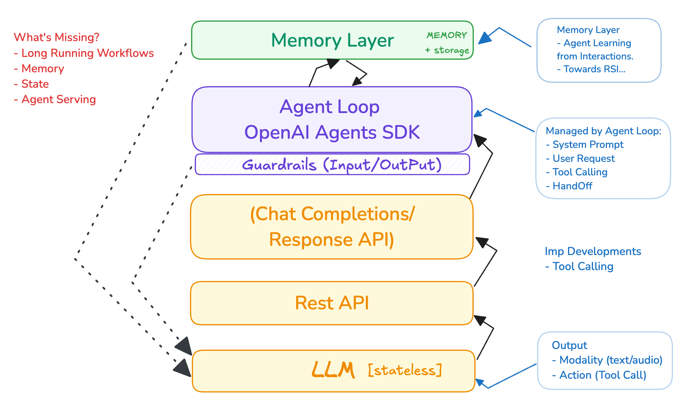

**LLMs se Stateful Long-Running Multi-Agent Systems Tak (Urdu Summary)**

**Mukhtasar Tareef**:
2025 ko Agentic AI ka saal kaha ja raha hai. Enterprises AI agents banayenge jo workflows ko automate karenge. Yeh SaaS (Software as a Service) ka agla qadam hai, jahan software khud tasks karta hai, sirf tools dene ke bajaye. Agentic AI mein reasoning, adaptability, aur autonomy shamil hai.

**AI Agents Kya Hain?**  
- **Definition**: AI agents LLMs hote hain jo ek iterative loop mein kaam karte hain, tools aur feedback (tool call results) ka istemal karte hue khud planning aur actions karte hain, aksar human checkpoints ke saath.  

- **Breakdown**:  
  - **LLMs**: Yeh agent ka core dimaag hain.  
  - **Iterative Loop**: Plan, action, aur observation ka cycle (think-act-observe).  
  - **Tools**: External APIs ya functions se duniya se rabta (jaise search, data fetch).  
  - **Feedback**: Tool results ya inputs se agla qadam tay hota hai.  
  - **Autonomy**: Fixed script ke baghair khud decisions lete hain.  
  - **Human Checkpoints**: Zaroori decisions ke liye insan ka control.  

**LLM APIs**:
- **Kya Hain?**: LLM APIs (jaise OpenAI, Anthropic, Google Gemini) developers ko asaan, scalable access dete hain taake agents banaye ja sakein.  
- **Kaam**: Reasoning, tool-calling, aur structured output dete hain.  
- **Ahmiyat**: Pehle custom models banane parte the, jo mehnga tha. APIs ne yeh sab asaan kar diya.  
- **Standardization**: OpenAI Chat Completion API ab standard ban gaya hai, aur zyadatar LLM providers isse support karte hain.  

**Responses API**:
- **Kya Hai?**: OpenAI ka naya API (March 2025), jo Chat Completion API ka advanced version hai.  
- **Features**:  
  - Tool support (web search, file search, computer use).  
  - Multi-tool workflows aur state management.  
  - Chat Completion se zyada flexible aur powerful.  
- **Agentic AI ke Liye**: Yeh agents ko autonomous banata hai jo khud data fetch karte hain ya tasks karte hain.  
- **Future**: Assistants API 2026 tak khatam ho jayega, aur Responses API agentic systems ka base banega.  
- **OpenAI Agents SDK**: Responses API ke saath kaam karta hai multi-agent systems ke liye.  

**Tool Calling**:
- **Kya Hai?**: LLMs tool signatures dekhte hain aur client app ko batate hain kon sa tool call karna hai. Client tool call karta hai, result LLM ko bhejta hai, aur LLM final jawab deta hai.  
- **Ahmiyat**: Yeh agents ko information lene aur actions karne ke liye zaroori hai. Multiple tools ek saath call ho sakte hain.  
- **Agent Loop**: Plan-tool call-result-final response ka cycle.  

**System aur User Prompts**:
- **System Prompt**: LLM ka role ya behavior set karta hai (maslan, "Tum ek chef ho"). Developer isse control karta hai.  
- **User Prompt**: User ka specific sawal (jaise, "Dinner mein kya hai?").  
- **Fark**: System batata hai kaise jawab dena hai; user batata hai kya jawab dena hai.  
- **Stateless**: Har request mein system aur user prompt bhejne parte hain, saath mein context (previous interactions).  

**Short-Term Memory**:
- **Kya Hai?**: Ek session ka temporary context (recent chat history).  
- **Kaise Kaam Karta Hai?**: Prompt mein shamil hota hai, LLM ke context window ke andar.  
- **Misal**: "Weather kaisa hai?" → "Sunny hai" prompt mein shamil hota hai.  

**Long-Term Memory**:
- **Kya Hai?**: Permanent info jo session ke baad bhi rehti hai (jaise user preferences).  
- **Kaise Kaam Karta Hai?**: External database (vector store) mein store hota hai, retrieval tool ya automatic system se milta hai.  
- **Misal**: "User ko spicy khana pasand hai" database se nikalta hai.  
- **Agentic RAG**: Retrieval-Augmented Generation mein agent khud memory fetch karta hai, aksar tool call ke zariye, ya pre-loaded context se.  

**Multi-Agent Systems**:
- **System Prompts**: Har agent ka role define karta hai (jaise, "Tum researcher ho").  
- **Message Passing**: Agents ke beech communication, aksar tool calling (handoff) ke zariye, ya memory, queues, events se.  
- **Foundation**: Framework, coordination, aur tools system ko chalate hain.  

**Model Context Protocol (MCP)**:
- **Kya Hai?**: Tool calling ka standard jo scalable aur interoperable hai.  
- **Kaise Kaam Karta Hai?**:  
  - MCP servers tools expose karte hain (jaise get_weather).  
  - MCP clients (agents) tools discover aur call karte hain JSON-RPC se.  
- **Fayda**: Ek universal interface deta hai, bespoke connectors ki zarurat nahi.  
- **Dynamic Discovery**: Agents runtime pe tools dekhte hain, hardcoded info ke baghair.  

**Structured Output**:
- **Kya Hai?**: LLMs JSON ya structured format mein jawab dete hain, jo agents ke liye parse karna asaan hai.  
- **Ahmiyat**: Actions lene ke liye zaroori hai.  

**/llms.txt**:
- **Kya Hai?**: Website content ko LLM-friendly banane ka standard (Markdown format).  
- **Zarurat**: Websites ka complex HTML LLMs ke liye mushkil hai, chhota context window hota hai.  
- **Fayda**: Concise, expert info ek jagah deta hai.  
- **Comparison**: MCP tool calling ke liye hai, /llms.txt content summarization ke liye, dono ek dosre ke saath kaam karte hain.  

**Design Patterns (Anthropic)**:
- **Workflows vs Agents**: Workflows predefined hote hain; agents dynamically plan aur tools istemal karte hain.  
- **Patterns**:  
  1. **Prompt Chaining**: Ek LLM ka output dosre ke liye input (jaise draft → translate).  
  2. **Routing**: LLM input ko classify karta hai aur task bhejta hai.  
  3. **Parallelization**: Ek saath multiple LLM calls (voting ya subtasks ke liye).  
  4. **Orchestrator-Workers**: Ek LLM tasks delegate karta hai aur results milata hai.  
  5. **Evaluator-Optimizer**: Ek LLM output banata hai, dosra check karta hai aur behtar karta hai.  
- **Implementation**:  
  - **Short-Term**: Python mein local workflows (jaise OpenAI Agents SDK).  
  - **Long-Term**: Cloud mein stateful workflows (Kubernetes, serverless containers).  

**Short-Term vs Long-Term Workflows**:
- **Short-Term**:  
  - Python ya local setup se manage hota hai.  
  - Ephemeral tasks ke liye, memory mein kaam karta hai.  
  - Misal: Ek script mein planner, researcher, writer agents chalte hain.  
- **Long-Term**:  
  - Cloud infrastructure zaroori (Kubernetes, Postgres, Redis).  
  - State persistence, scalability, aur reliability ke liye.  
  - Misal: Multi-week project tracking agent jo progress save karta hai.  

**Layered Architecture**:
- **Layer 1 (Core Execution)**: Short-term tasks ke liye lightweight agent loop (LLM planning, tool use).  
- **Layer 2 (Durability & Orchestration)**: Long-term ke liye state management, error handling, aur async tasks (FastAPI, Docker, Kafka, Kubernetes).  

**Guiding Principles for Agentic AI**:
1. **Minimal Abstractions**: Direct access to reasoning, tools, aur outputs, complex layers nahi.  
   - **Kyun**: Transparency aur customization ke liye.  
2. **Building Blocks**: Sirf zaroori elements, rigid templates nahi.  
   - **Kyun**: Flexibility ke liye users khud solutions banayein.  
3. **Adaptability & Transparency**: Agile, lean system jo troubleshoot aur enhance karna asaan ho.  
   - **Kyun**: Rapid experimentation ke liye.  
4. **Simplicity se Power**: Users ko pura control, jaise ek Swiss Army knife.  
   - **Kyun**: Simple system se bade kaam asani se.  

**Faisla**:  
Agentic AI, LLMs, Responses API, aur MCP jaise standards ke saath, workflows se dynamic, autonomous systems tak jati hai. Short-term tasks Python mein asaan hain, jabke long-term ke liye cloud zaroori hai. Layered architecture aur simple principles se yeh systems duniya bhar mein revolution la sakte hain.