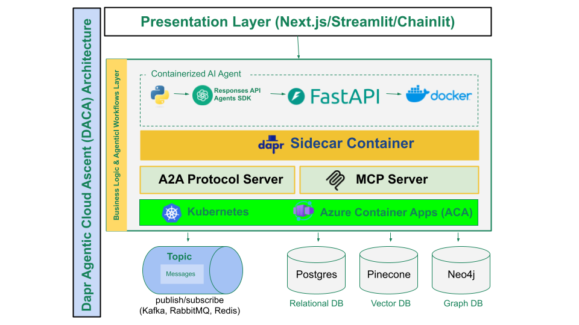

## **LLMs se Stateful Long-Running Multi-Agent Systems Tak**

**Mukhtasar Tareef**:
Yeh document teen alag hisson mein baanta gaya hai, har ek ek naye sawal ko samajhta hai:

1. **AI Agents Kya Hain?**: AI agents aur unki khususiyaat kya hain?
2. **Agentic AI ke Liye Guiding Principles**: Inhe banane ke buniyadi usool kya hone chahiye?
3. **Multi-Agent Systems ka Architecture**: AgentiaCloud ke liye kaisa architecture istemal ho?

**Agentic AI Development aur Use Cases**:
2025 mein Agentic AI duniya bhar mein mukhya topic hai. Bade tech companies jaise OpenAI, Microsoft, Google, AWS, Anthropic, aur dosre is field mein aage hain. Pakistan aur duniya mein Agentic AI ke zariye inqalab lane ka maqsad hai, khaas tor pe vertical agentic solutions banane ka.

**Domains aur Agents**:
Hamne mukhtalif domains mein agents ke bare mein documentation banayi hai, jo global scale pe AI agents banane mein madad degi. Yeh agents event-driven architecture (EDA), three-tier architecture, stateless computing, CronJobs, human-in-the-loop (HITL), aur kuch cases mein LLM intelligence ka istemal karte hain. Ye hain mukhya agents:

1. **Email Agent (Communication)**  
   - **Kaam**: Emails check karta hai, filter karta hai, jawab suggest karta hai, aur user ki tasdeeq ke baad bhejta hai.  
   - **Khususiyat**: Automation aur HITL istemal karta hai.

2. **Supply Chain Optimization Agent (Logistics)**  
   - **Kaam**: Inventory dekhta hai, delivery routes behtar karta hai, aur actions suggest karta hai.  
   - **Khususiyat**: Optimization aur manual adjustments ke liye HITL.

3. **Healthcare Patient Monitoring Agent (Healthcare)**  
   - **Kaam**: Patient ke vitals check karta hai, issues dekhta hai, aur doctors ko alert karta hai.  
   - **Khususiyat**: Real-time monitoring aur HITL.

4. **Financial Trading Agent (Finance)**  
   - **Kaam**: Market data dekhta hai, trades suggest karta hai, aur traders ko notify karta hai.  
   - **Khususiyat**: Strategy-based automation aur HITL.

5. **Personalized Learning Agent (Education)**  
   - **Kaam**: Students ke progress ko dekhta hai, personalized tasks deta hai, aur teachers ko batata hai.  
   - **Khususiyat**: Automation aur customization.

6. **Blood Bank ERP Agent (Healthcare)**  
   - **Kaam**: Blood units track karta hai, donors se rabta rakhta hai, aur staff ko madad deta hai.  
   - **Khususiyat**: LLM se donor engagement aur insights, plus inventory optimization.

7. **Shopping Cart & Inventory Agent (E-commerce)**  
   - **Kaam**: Carts manage karta hai, inventory track karta hai, aur restocking suggest karta hai.  
   - **Khususiyat**: Dynamic pricing aur LLM recommendations.

8. **Social Media Account Agent (Social Media)**  
   - **Kaam**: Activity dekhta hai, posts suggest karta hai, aur analytics deta hai.  
   - **Khususiyat**: Engagement optimization aur LLM content.

9. **Customer Acquisition Agent (Sales/CRM)**  
   - **Kaam**: LinkedIn pe prospects dhundta hai, messages suggest karta hai, aur sales reps ko notify karta hai.  
   - **Khususiyat**: Lead scoring aur LLM outreach.

**Dapr Agentic Cloud Ascent (DACA) Design Pattern**:
DACA ek design pattern hai jo planet-scale multi-agent systems banane ke liye hai. Yeh OpenAI Agents SDK, Dapr ke distributed features, aur cloud services ka istemal karta hai. Isme yeh shamil hain:

- **Event-Driven Architecture (EDA)**: Real-time actions ke liye.
- **Three-Tier Architecture**: Scalability aur management ke liye.
- **Stateless Computing**: Tezi aur efficiency ke liye.
- **CronJobs**: Scheduled tasks ke liye.
- **HITL**: Human oversight ke liye.
- **Deployment**: Local se cloud tak, jaise Docker, Kubernetes, aur Azure Container Apps.

**Aur Domains (Mukhtasar)**:
- **Agriculture**: Smart Irrigation Agent (IoT aur LLM reports).
- **Transportation**: Public Transit Agent (dynamic routing aur LLM announcements).
- **Environment**: Air Quality Agent (pollution alerts aur LLM advisories).
- **Entertainment**: Content Recommendation Agent (playlists aur LLM descriptions).
- **HR**: Employee Onboarding Agent (automation aur LLM emails).
- **Real Estate**: Property Management Agent (maintenance aur LLM notifications).
- **Gaming**: In-Game Event Agent (events aur LLM quests).
- **Legal**: Contract Review Agent (compliance aur LLM summaries).
- **Travel**: Itinerary Agent (bookings aur LLM plans).
- **Cybersecurity**: Threat Detection Agent (alerts aur LLM explanations).
- **Fitness**: Nutrition Agent (plans aur LLM motivation).
- **Government**: Citizen Service Agent (permits aur LLM responses).
- **Manufacturing**: Production Line Agent (optimization aur LLM reports).
- **Event Planning**: Coordination Agent (logistics aur LLM invitations).
- **Charity**: Donation Agent (campaigns aur LLM thank-yous).

**Faisla**:
DACA design pattern multi-agent systems ke liye ek asaan, scalable, aur resilient tareeqa deta hai. Har agent apne domain mein automation, HITL, aur LLM intelligence ka istemal karta hai, jo mukhtalif industries mein revolution la sakta hai. Yeh pattern Pakistan aur duniya ke liye naye imkanat kholta hai.
