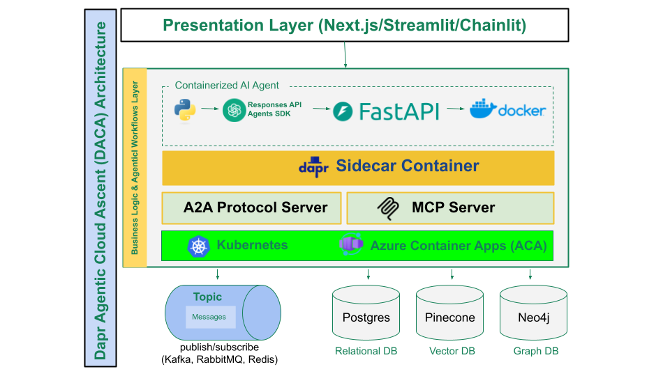

### **Dapr Agentic Cloud Ascent (DACA) Design Pattern ke Saath Agentic AI Seekhein**

**Mukhtasar Tareef**:
Yeh repository [Panaversity Certified Agentic & Robotic AI Engineer](https://docs.google.com/document/d/15usu1hkrrRLRjcq_3nCTT-0ljEcgiC44iSdvdqrCprk/edit?usp=sharing) program ka hissa hai, jo AI-201 aur AI-202 courses ko cover karta hai. Yeh Agentic AI systems ko cloud-native technologies pe develop aur deploy karne ke liye DACA design pattern pe focus karta hai.

**DACA Kya Hai?**  
Dapr Agentic Cloud Ascent (DACA) ek design pattern hai jo planet-scale multi-agent systems ke liye banaya gaya hai. Yeh OpenAI Agents SDK, Dapr, aur cloud-native tools ka istemal karta hai taake scalable, resilient, aur efficient agentic workflows banaye ja sakein.  
- **[Comprehensive Guide to DACA](https://github.com/panaversity/learn-agentic-ai/blob/main/comprehensive_guide_daca.md)**  

**Core Libraries**:
- OpenAI Agents SDK aur Responses API
- Docker Containers
- Docker Compose
- CockroachDB
- CronJobs
- RabbitMQ
- MCP Server SDK
- Dapr
- Azure Container Apps
- Kubernetes

**Target Users**:
- Agentic AI Developers
- AgentOps Professionals

**Kyun OpenAI Agents SDK Zyadatar Cases ke Liye Behtar Hai?**  
**Table: AI Agent Frameworks ki Tulna**

| **Framework**         | **Abstraction Level** | **Khususiyaat**                                                                 | **Learning Curve** | **Control Level** | **Simplicity** |
|-----------------------|-----------------------|---------------------------------------------------------------------------------|--------------------|-------------------|----------------|
| **OpenAI Agents SDK** | Minimal              | Python-first, core primitives (Agents, Handoffs, Guardrails), direct control    | Low               | High             | High           |
| **CrewAI**            | Moderate             | Role-based agents, crews, tasks, collaboration                                 | Low-Medium        | Medium           | Medium         |
| **AutoGen**           | High                 | Conversational agents, flexible patterns, human-in-the-loop                    | Medium            | Medium           | Medium         |
| **Google ADK**        | Moderate             | Multi-agent hierarchies, Google Cloud, rich tools, bidirectional streaming     | Medium            | Medium-High      | Medium         |
| **LangGraph**         | Low-Moderate         | Graph-based workflows, explicit state management                              | Very High         | Very High        | Low            |
| **Dapr Agents**       | Moderate             | Stateful actors, event-driven, Kubernetes, 50+ connectors, resiliency          | Medium            | Medium-High      | Medium         |

**Fawaid**:
- **Simplicity aur Ease of Use**: OpenAI Agents SDK ka learning curve low hai, rapid development ke liye best.
- **High Control, Minimal Abstraction**: Flexibility deta hai complex systems ke liye, LangGraph ki tarah over-complex nahi.
- **Comparison**: CrewAI, AutoGen, Google ADK, aur Dapr Agents se zyada asaan aur powerful balance rakhta hai. LangGraph zyada control deta hai, lekin complexity ke wajah se har case ke liye practical nahi.

**Faisla**: Agar aapko tezi, flexibility, aur asaan iteration chahiye, to OpenAI Agents SDK behtar hai. Enterprise-scale ya highly complex workflows ke liye Dapr Agents ya LangGraph soch sakte hain.

**Core Courses**:

1. **AI-201: Fundamentals of Agentic AI - From Foundations to DACA Distributed Agents**  
   - **Kya Hai?**: Agentic AI ka introductory course jo autonomous systems, Agentic RAG, aur MCP tool calling pe focus karta hai.  
   - **Focus**: Local development mein DACA pattern ka istemal, OpenAI Responses API aur Agents SDK ke saath prototyping.  
   - **Topics**: Short/long-term memory, standardized tool calling, Agentic RAG, deployment, observability.  
   - **Playlist**: [AI-201 Videos](https://www.youtube.com/playlist?list=PL0vKVrkG4hWovpr0FX6Gs-06hfsPDEUe6)  
   - **Prerequisite**: [AI-101: Modern AI Python Programming](https://github.com/panaversity/learn-modern-ai-python)

2. **AI-202: DACA Medium Enterprise Scale Distributed Agents: Managed Serverless Platforms**  
   - **Kya Hai?**: Advanced course jo enterprise-ready AI agent systems pe focus karta hai.  
   - **Focus**: DACA pattern ka istemal Azure Container Apps (ACA) mein medium-scale systems ke liye.  
   - **Topics**: Sophisticated reasoning, task execution, multi-agent collaboration.  
   - **Prerequisite**: AI-201

3. **AI-301: DACA Planet-Scale Distributed Agents: Kubernetes with Self-Hosted LLMs**  
   - **Kya Hai?**: Agentic AI series ka sabse advanced course, jo stateful aur scalable agents pe focus karta hai.  
   - **Focus**: DACA pattern Azure Container Apps mein, plus Docker, Kubernetes, Dapr, aur cloud-native MCP servers.  
   - **Topics**: Backend development, cloud deployment, user-centered design, operational practices.  
   - **Prerequisite**: AI-201

**Faisla**:  
DACA design pattern cloud-native technologies ke saath Agentic AI systems ko asaan se planet-scale tak le jata hai. OpenAI Agents SDK iski buniyad hai kyunki yeh simple, flexible, aur powerful hai. AI-201, AI-202, aur AI-301 courses developers ko local prototyping se enterprise aur global-scale deployment tak le jate hain, jo Agentic AI ke future ke liye zaroori hai.